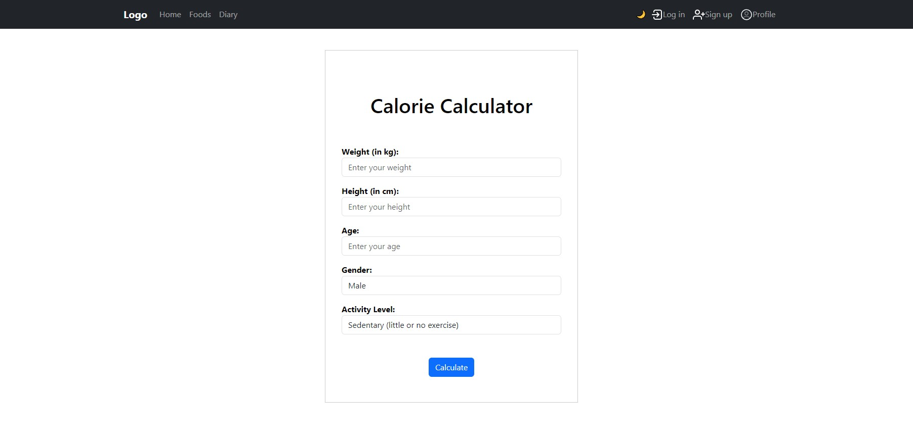
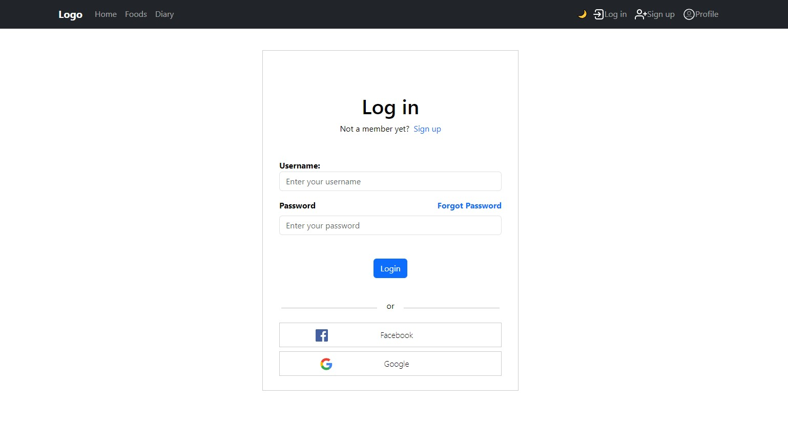
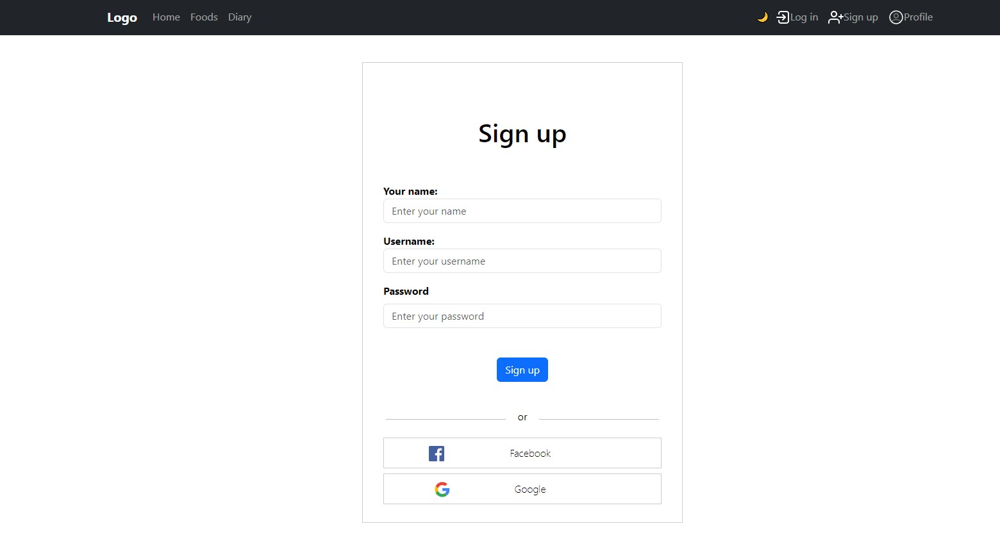
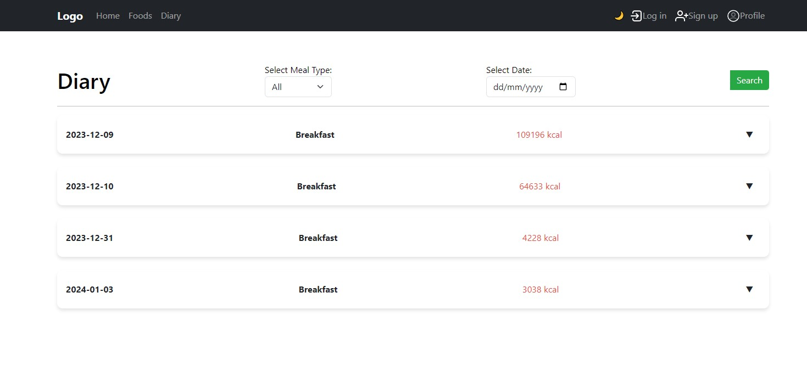
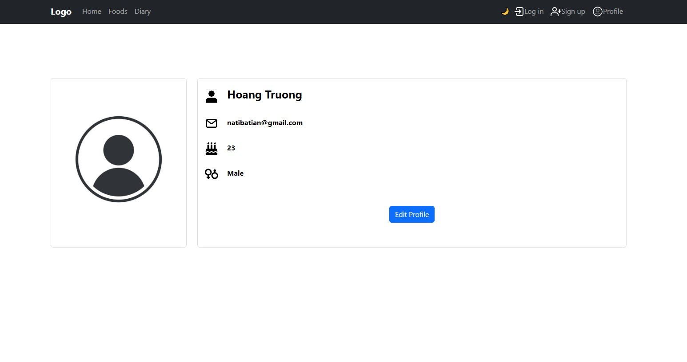

# nutriLog
The website is to record nutritional information.

# Description
The website helps users search for dishes, look up calories and calculate the number of calories consumed each day

## Technology Stack

- **Frontend**: [Vue.js](https://vuejs.org/)
- **API** : [Edamam](https://www.edamam.com/)

## Features

### 1. Food search

Integrates a search engine that allows users to enter a dish name or main ingredient and search for corresponding dishes.

### 2. Display nutritional information: 

Display detailed nutritional information for each dish, including calories, protein, carbohydrates, fat, and other data if available.

### 3. Calculate daily calories consumed: 

Provides a calorie calculator that allows users to enter information about weight, height, age and activity level, then displays the number of calories needed to maintain or losing weight.

### 5. Activity history: 

Stores users' search history and viewed dishes so they can easily access the information they looked up again.

### 6. Create a favorite dish list: 

Allows users to store their favorite dishes for easy access and reference later.

### 7. Register new user

BusGo allows users to create new accounts, providing them with personalized features such as saving favorite routes, setting preferences, and receiving updates on service changes. 

## Demo
### Home Page

### Log In Page

### Food Page

### Recipe modal

### Diary Page

### Schedule Page

### Profile Page

## Contact Information

For inquiries or assistance, please contact us at [natibatian@gmail.com](mailto:natibatian@gmail.com).